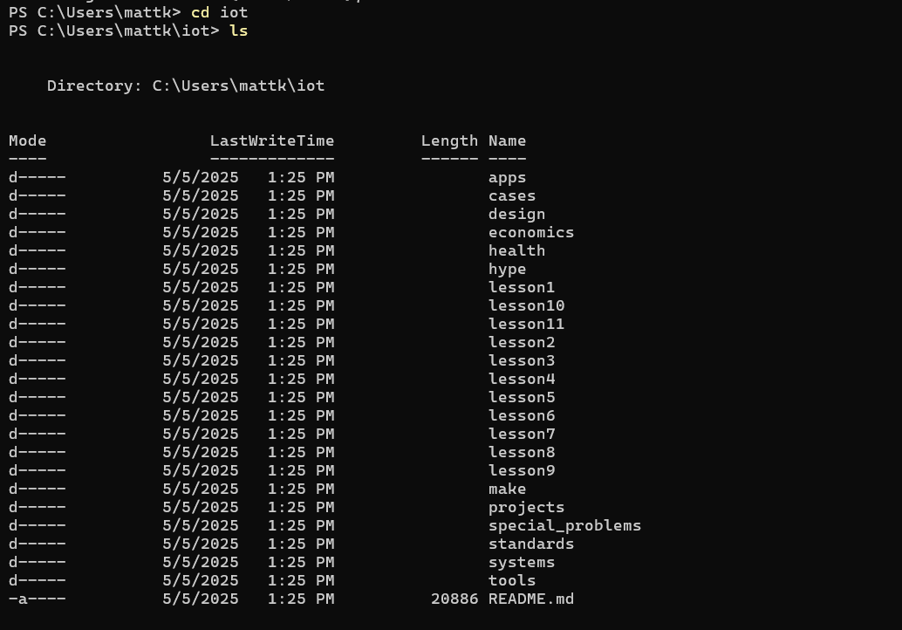
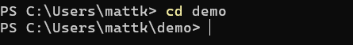

### Matthew Kemenosh
### Lab 2 — Command Line
Since I'm using Windows PowerShell, I converted some Unix commands into Windows where noted.
### hostname
Displays the computer's network host name

### env
Displays the computer's environment variables

### ps
Displays information about currently running processes on the computer. I also included the windows closely equivalent 'tasklist' command after the 4th image

### pwd

### git clone https://github.com/kevinwlu/iot.git

### cd iot :  ls

### cd :  df  :  mkdir demo

For windows terminal, I used cd .. to get back to home directory
### cd demo

### nano file :  cat file

### cp file file1 :  mv file file2  :  rm file2

### clear

After typing in clear, the etnire screen history clears including the clear command line so this is the after.
### man uname  : uname -a

### ifconfig
Converted to ipconfig, and I also added ipconfig /all to show the full configurations, with the important info blacked out ;P

### ping localhost

### netstat

