### Matthew Kemenosh
### Lab 2 — Command Line
Since I'm using Windows PowerShell, I converted some Unix commands into Windows where noted.
### hostname
Displays the computer's network host name
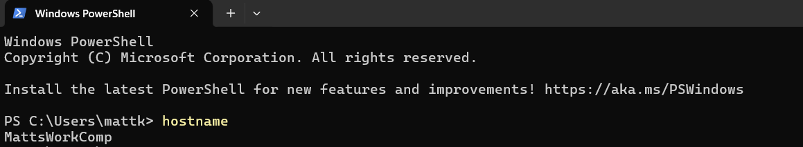
### env
Displays the computer's environment variables
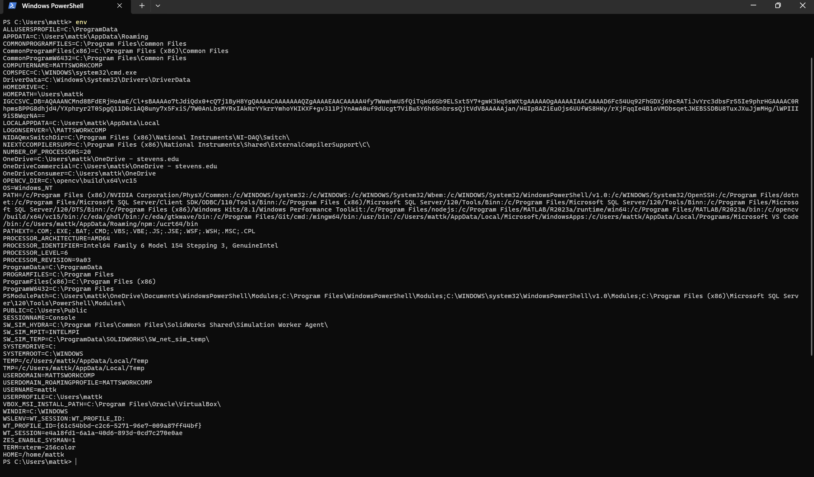
### ps
Displays information about currently running processes on the computer. I also included the windows closely equivalent 'tasklist' command after the 4th image
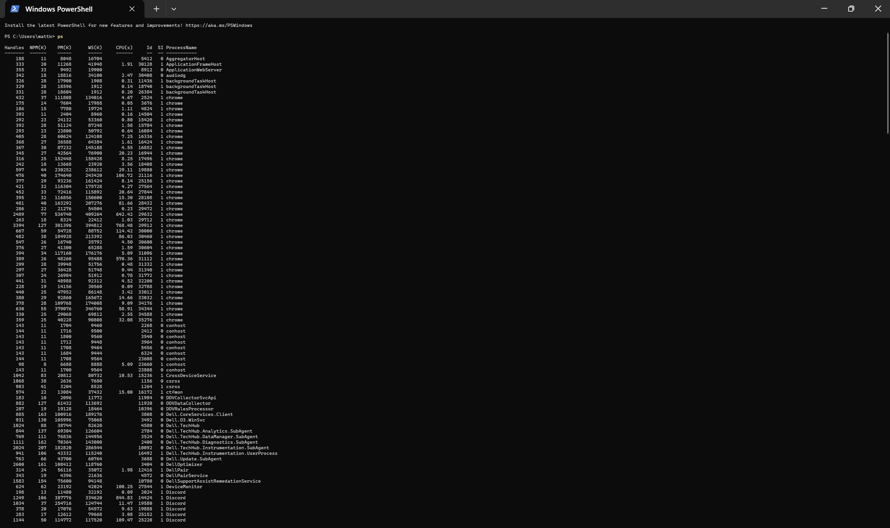
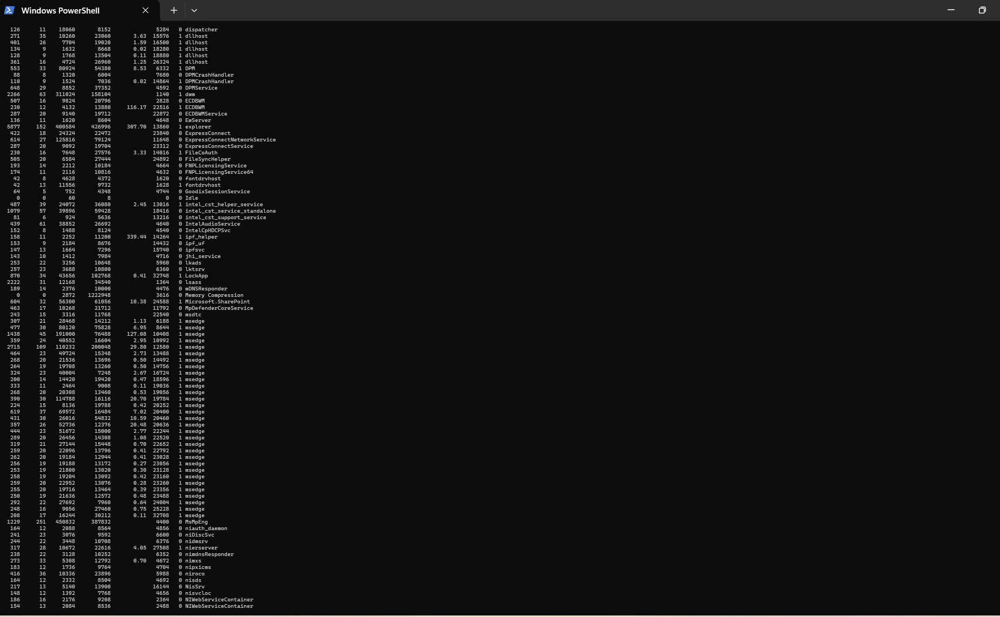
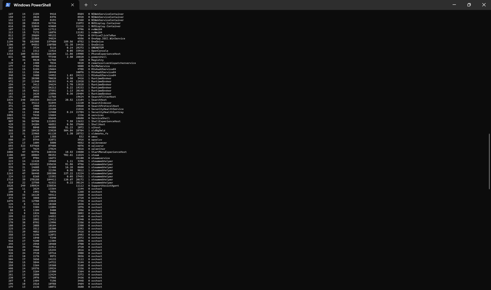
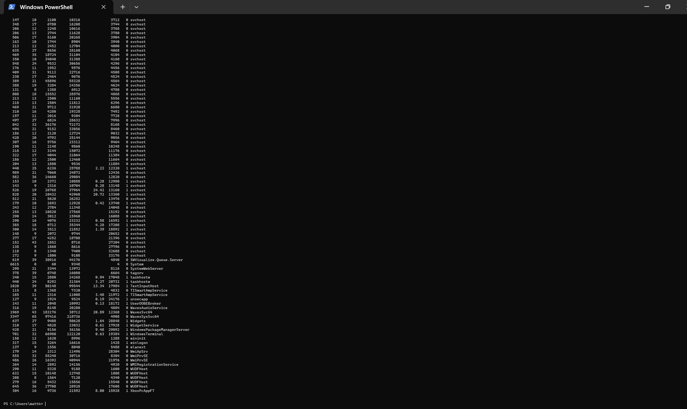
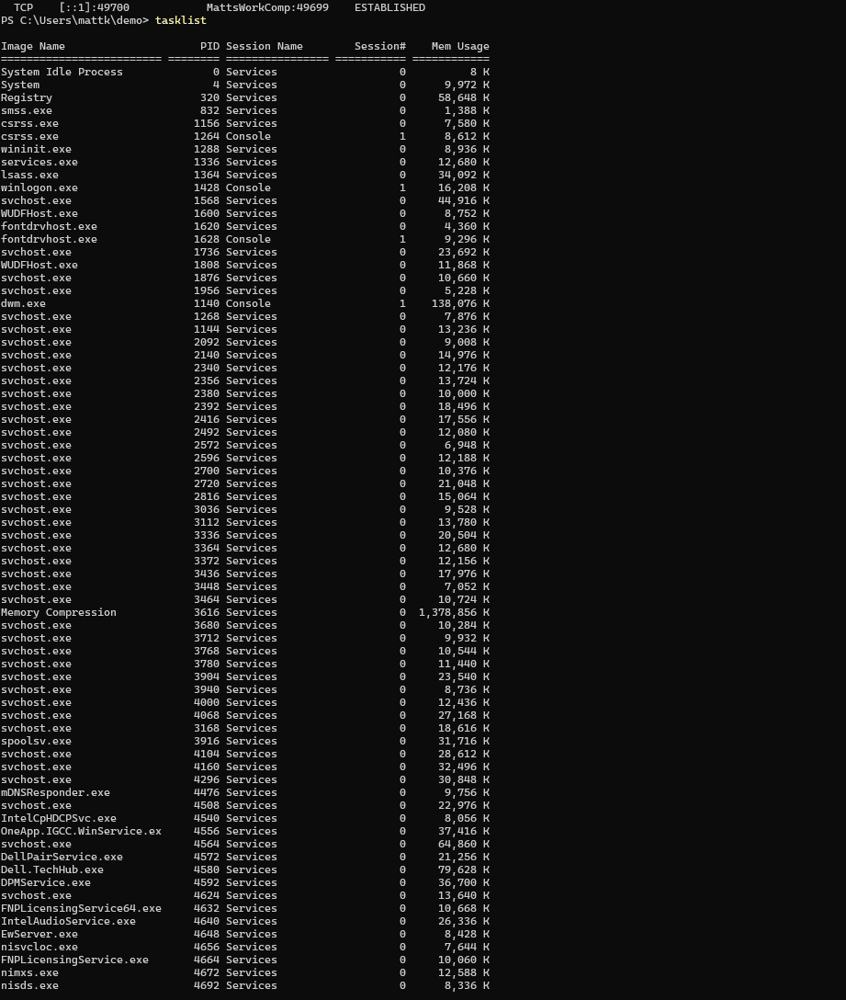
### pwd
Displays the full path of the current directory you are located in
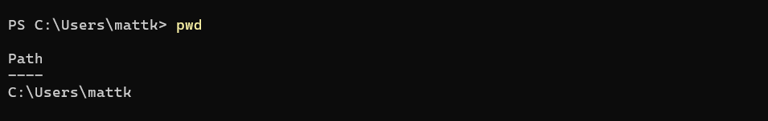
### git clone https://github.com/kevinwlu/iot.git
Makes a copy of the git repository that is located at the specified website. Git must be installed for this command to be recognized. For this case, a copy of the IOT repository is being made.
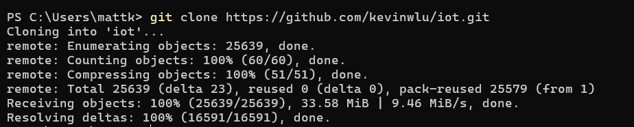
### cd iot :  ls
Combining both cd iot and ls commands. cd iot changes the working directory to IOT, and ls displays a list of all files in the current directory besides hidden files.
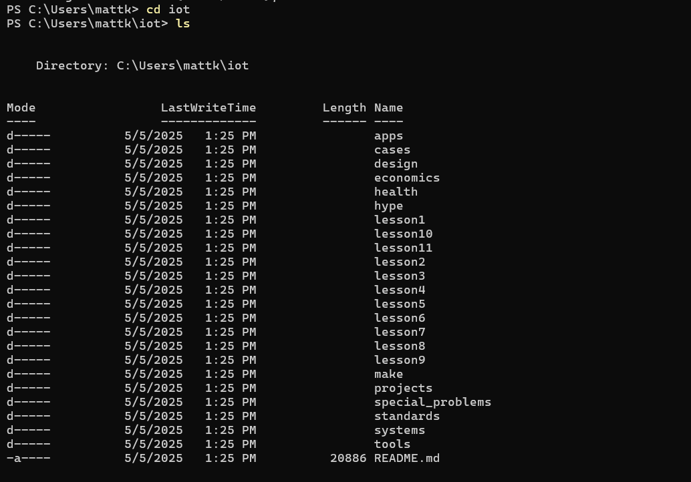
### cd :  df  :  mkdir demo
combining cd, df, anf mkdir demo. cd should take you back to your home directory, but for windows terminal, I used cd .. to get back to home directory. df displays information about disk space on a file system. mkdir demo makes a new directory named demo.
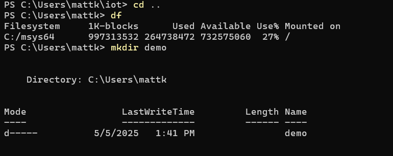
### cd demo
Changes the current working directory to demo.
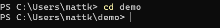
### nano file :  cat file
nano file opens a blank text editor where you can type to edit/add to the file since a file named 'file' does net yet exist. Once something is added, hit write out to save these changes into a file named 'file', and then returns you to the terminal. cat file displays the contents of 'file', which in this case says these are the contents in the nano file, skibidi.
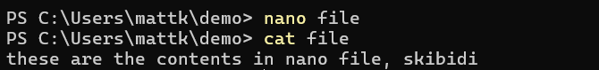
### cp file file1 :  mv file file2  :  rm file2
cp file file1 copies the contents of file into file1. mc file file2 moves or renames file to file2. rm file2 removes or deletes file2.
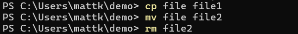
### clear
After typing in clear, the entire screen history clears including the clear command line so this is the after.

### man uname  : uname -a
converted to uname --help, opens the manual page for the 'uname' command. Manual pages show documentation about commands. and uname -a displays detailed system information in a single line.
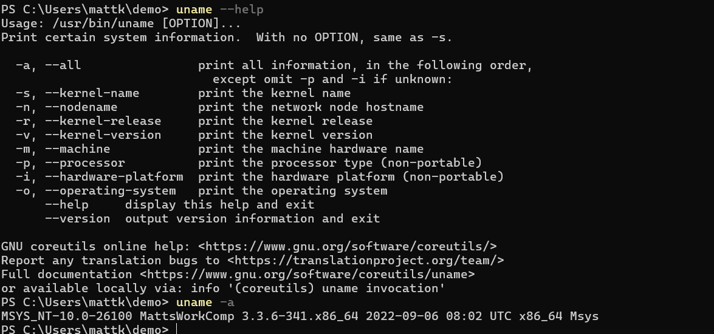
### ifconfig
Provides a comprehensive list of all network interfaces along with their respective IP addresses, MAC addresses, and other relevant details. Converted to ipconfig, and I also added ipconfig /all to show the full configurations, with the important info blacked out ;P

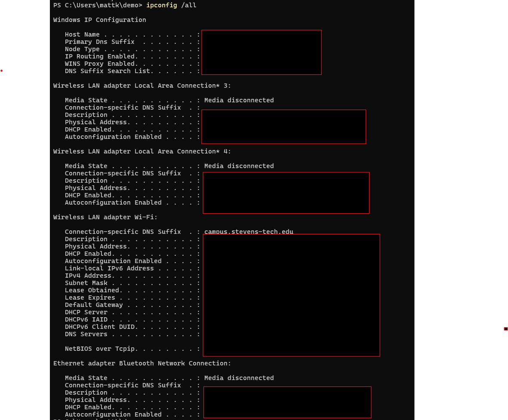

### ping localhost
Sends network packets to your own machine to check if the network stack is functioning properly.

### netstat
Displays information about your network connections, including active TCP connections, listening ports, routing table details, and network interface statistics.

